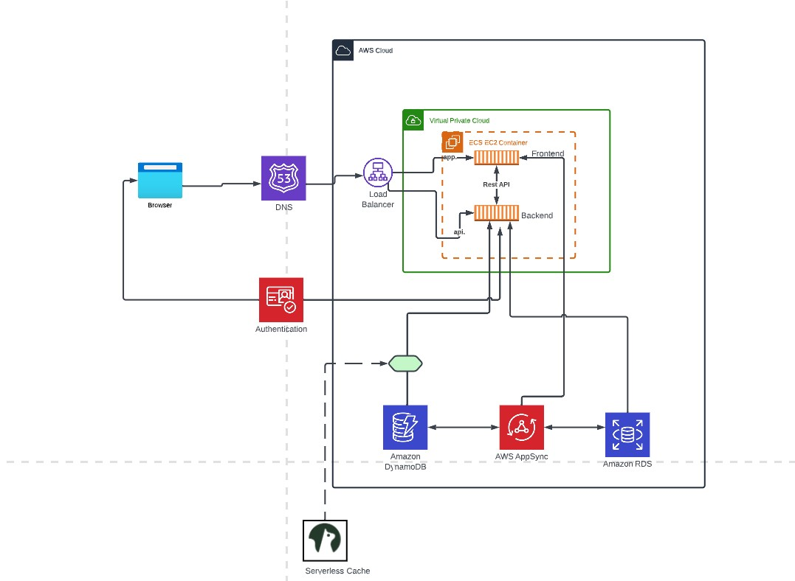

# Week 0 — Billing and Architecture

## Required Homework/Tasks

### Install AWS CLI


I did not know this step was suppsosed to be done through Gitpod or Github codespaces.
So installed the AWS CLI from AWS Docs


I did the following steps to install AWS CLI
I installed the AWS CLI via command in **Command Prompt**:

```
msiexec.exe /i https://awscli.amazonaws.com/AWSCLIV2.msi
aws --version
```


I attempted to run the command by typing in `aws` but I recieved an error


```
C:\Users\swaro>aws
'aws' is not recognized as an internal or external command
operable program or batch file.
```
I was able to resolve the error by closing command prompt, and opening it again.


### Setup an account in Lucid Chart for free
Created a free account in Lucid Chart platform.


[Proof of my Cruddur Lucid Chart ](https://lucid.app/lucidchart/7f7fd618-6cfb-416d-853a-b77da45ed7a2/edit?page=0_0#)

Napkin Diagram


## Homework Challenges
